# 总统模拟器 · President Simulator

> 每日总统简报(PDB)风格的信息聚合台 — 真实公开数据源,白宫椭圆办公室视觉。
>
> 卡通但专业的 UI:羊皮纸底色 · 鹰徽印章 · 邮戳序号 · 厚边卡片。

## 截图

| 简报 | 资产 | 日程 |
| --- | --- | --- |
| 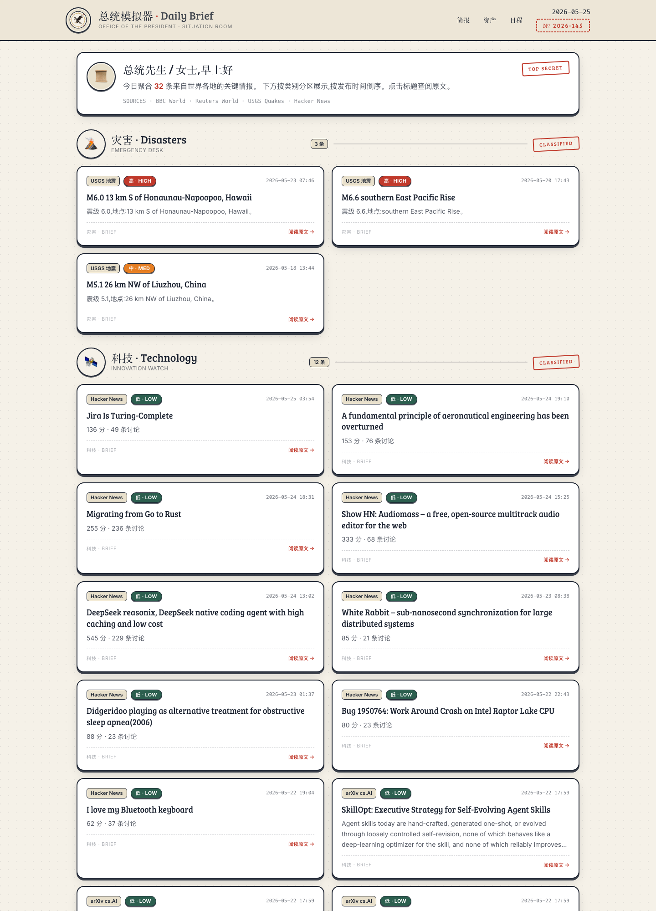 | 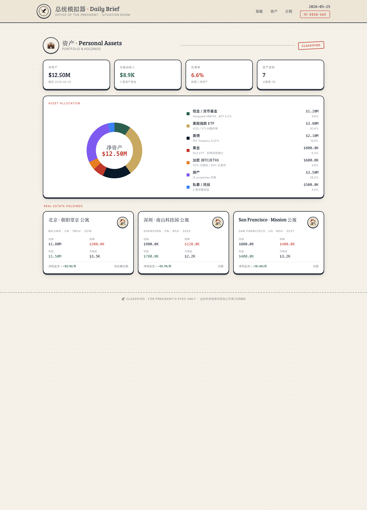 | 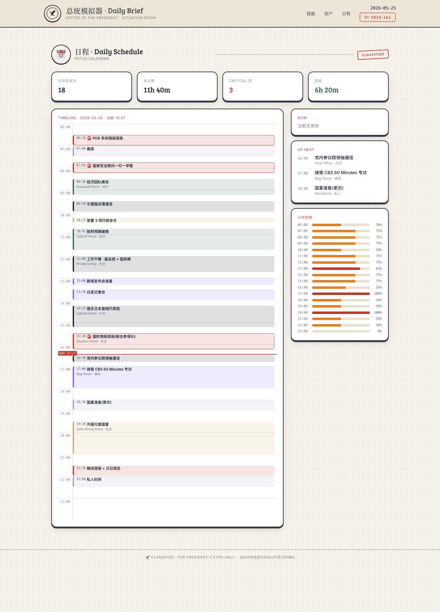 |

## Quickstart

```bash
git clone https://github.com/jaxblack/president-sim.git
cd president-sim
npm install
npm run dev        # http://localhost:3030
```

## 路由

| Path | 说明 |
| --- | --- |
| `/`              | 总统每日简报(按外交 / 灾害 / 科技 / 经济 / 金融分区,优先级徽章) |
| `/portfolio`     | 个人资产配置 + 房产持仓(KPI 卡 + SVG 饼图 + 房产现金流) |
| `/schedule`      | 总统日程时间轴(垂直时间线 + Now 红线 + 小时密度) |
| `/api/feed`      | 聚合新闻 JSON `{ items: FeedItem[] }` |
| `/api/portfolio` | 资产 JSON `{ portfolio, kpis }` |
| `/api/schedule`  | 日程 JSON |

## 信息源(全部免 key 公开数据)

**外交** · BBC World RSS · Reuters World RSS

**灾害** · USGS significant_week GeoJSON

**科技** · arXiv cs.AI/cs.LG Atom · GitHub Trending(创建日期 7 天内,带可选 `GH_TOKEN`) · Hacker News Firebase topstories

**金融** · CoinGecko top 8 市值 + 24h 涨跌 · Frankfurter 汇率(USD→CNY/EUR/JPY/GBP)

**经济** · World Bank GDP(US/CN/JP/DE)· FRED 10Y 国债 / 失业率 / CPI

每个 source 独立模块、`AbortController` 8s 超时、失败静默降级、`priority` 自动推断。

## 技术栈

- Next.js 14.2.5 (App Router · server components · `force-dynamic`)
- React 18.3.1 · TypeScript 5.5.3
- Tailwind 3.4.6(自定义 palette:`paper` / `ink` / `stamp-red` / `oval-green` / `alert`,字体 Bree Serif + Fredoka + Inter)
- rss-parser 3.13.0

## MVP 范围(明确未做)

为了快速跑通,**有意省略**:身份认证、数据库、单元测试、CI、Docker、部署脚本、决策提交、历史记录、PWA。
资产 / 日程数据来自 `data/*.json`(假数据 + 真实合理),不持久化。

## 文件结构

```
app/
  components/    Seal · BriefingCard · PriorityBadge · SectionHeader
  api/           feed · portfolio · schedule
  portfolio/     页面
  schedule/      页面
  page.tsx       首页(简报分区)
  layout.tsx     header(印章 + nav) + footer
lib/
  aggregator.ts  feed 聚合 + priority 推断
  sources/       arxiv · gh-trending · coingecko · frankfurter · worldbank · fred
  portfolio.ts   loadPortfolio + computeKpis
  schedule.ts    loadSchedule + now/upcoming/density
data/
  portfolio.json
  schedule.json
docs/
  screenshots/   home · portfolio · schedule
```

## 截图复现

```bash
npm run dev &
sleep 5
CHROME="/Applications/Google Chrome.app/Contents/MacOS/Google Chrome"
for p in "home /" "portfolio /portfolio" "schedule /schedule"; do
  n=${p%% *}; u=${p##* }
  "$CHROME" --headless=new --window-size=1440,2000 --hide-scrollbars \
    --screenshot="docs/screenshots/$n.png" "http://localhost:3030$u"
done
```

---

**注**:本应用所有信息均来自公开来源,仅供模拟演示,不构成任何投资 / 政策建议。


## Recent runs

### 2026-05-27 — Round 6 demo (plan skypool-plan-9a982a77)

本轮通过 SkyPool 多 follower 协作给总统模拟器加入 7 个新模块:**新闻源可配/注释/行政命令**(/news /orders)、**美股 + 美债利率 + 美联储看板**(/market /fed)、**12 城房产看板**(/realestate)、**日程编辑**(/schedule)、**他国态度**(/diplomacy)、**国力分值**(/scores)。

<p>
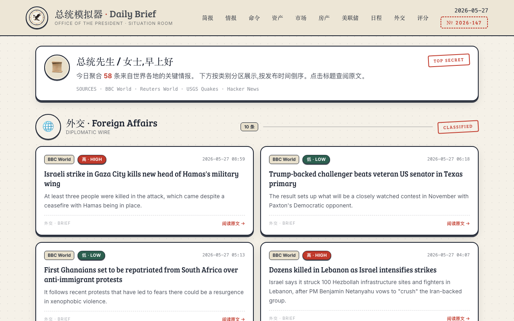
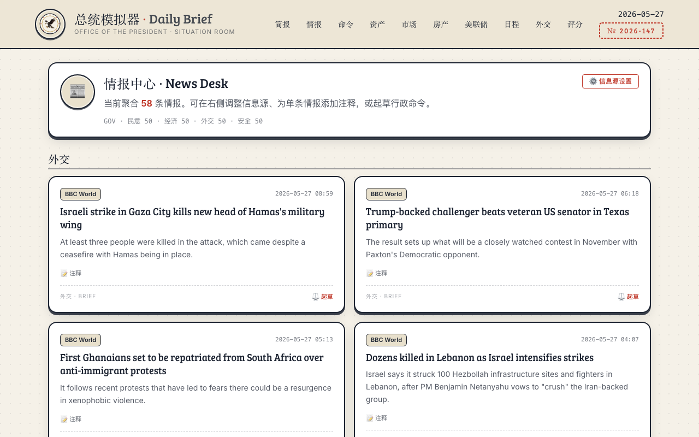
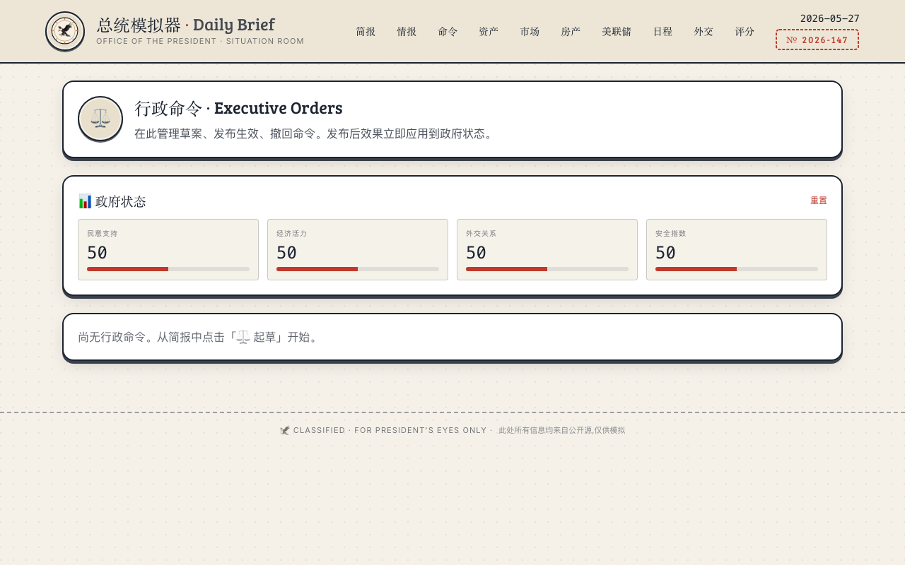
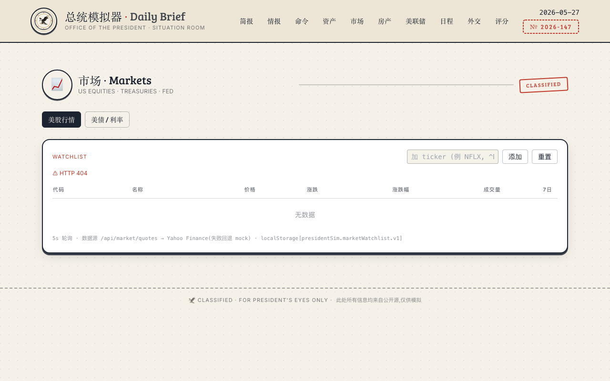
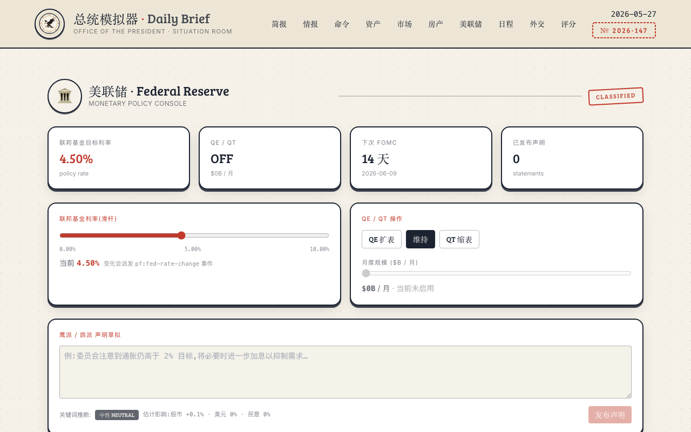
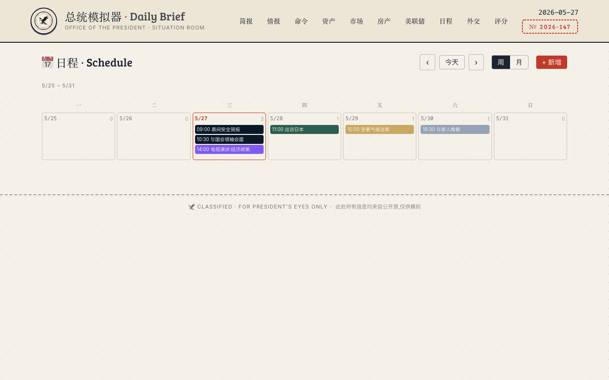
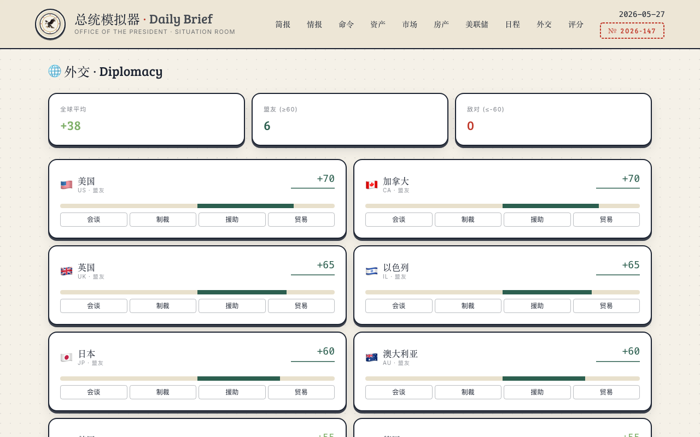
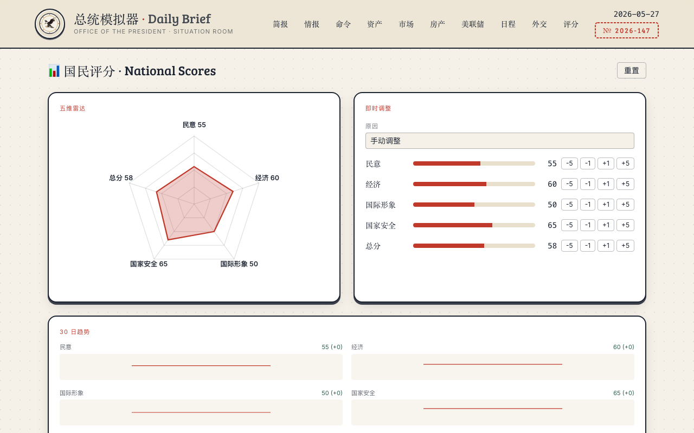
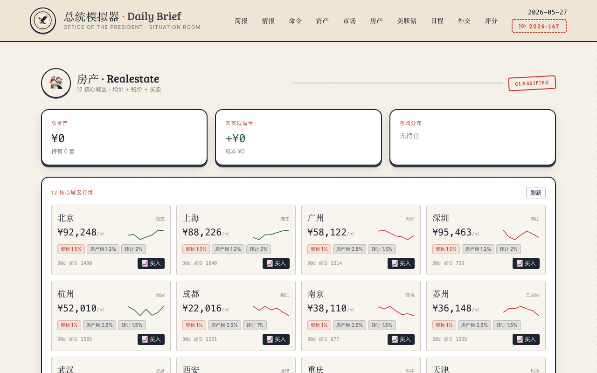
</p>
